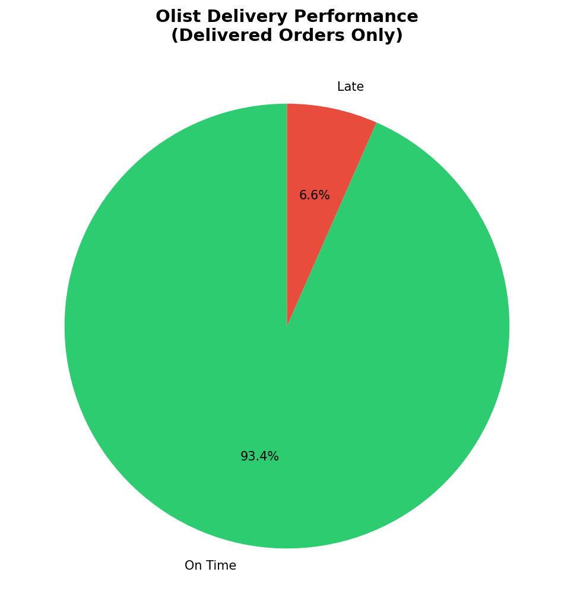
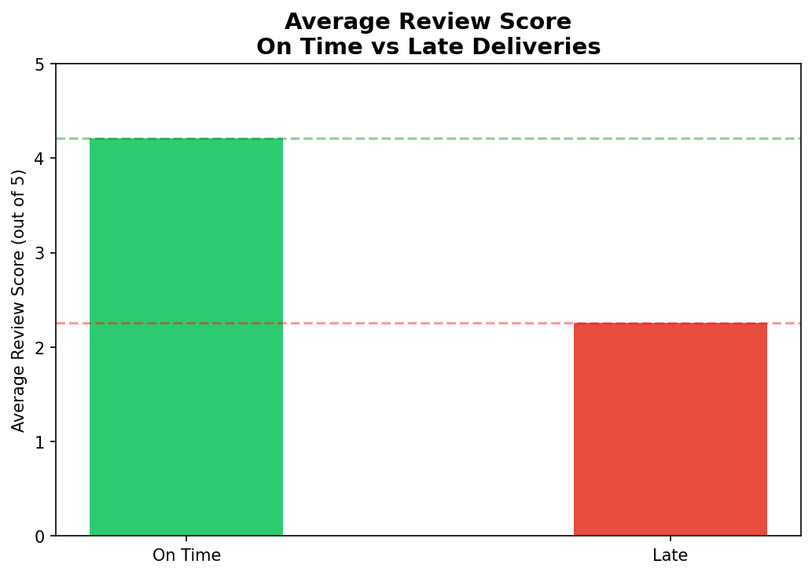
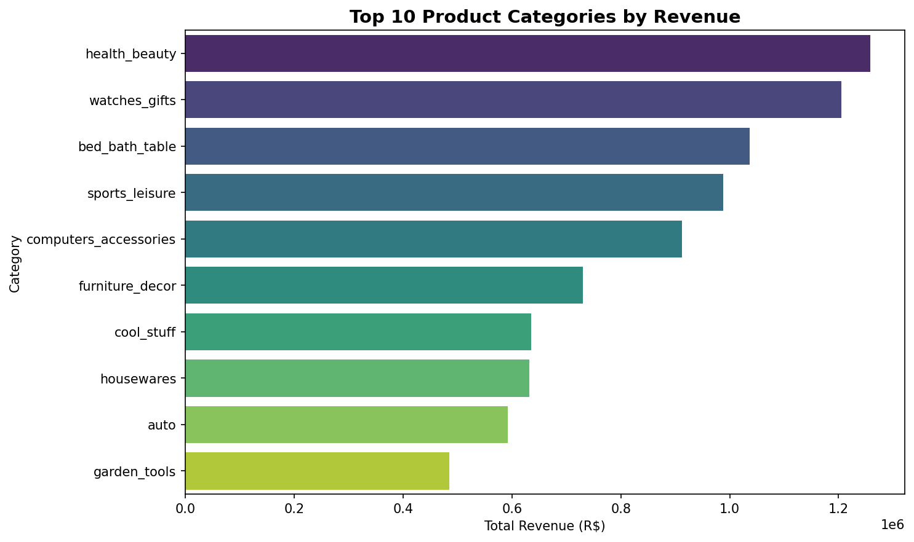
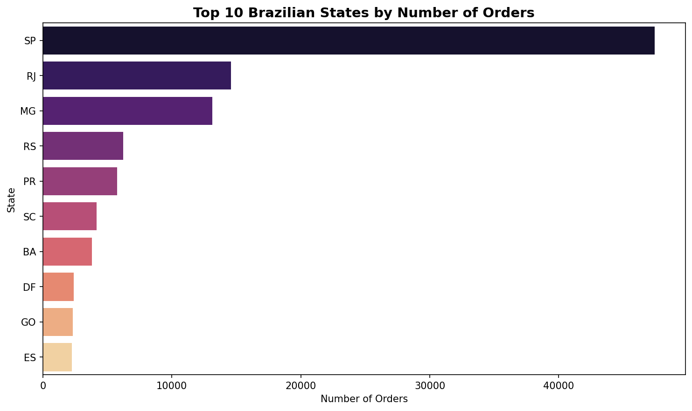
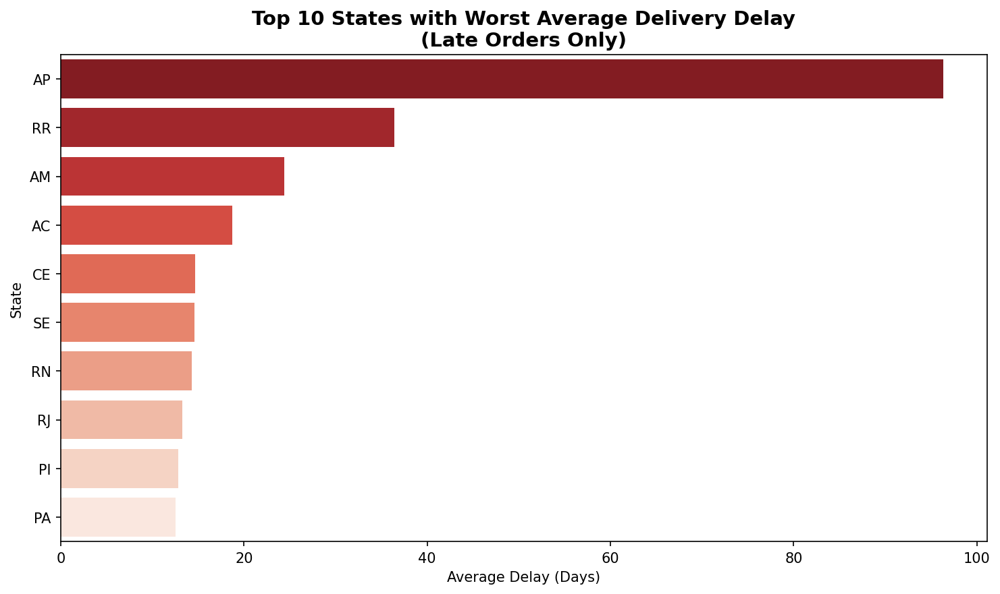
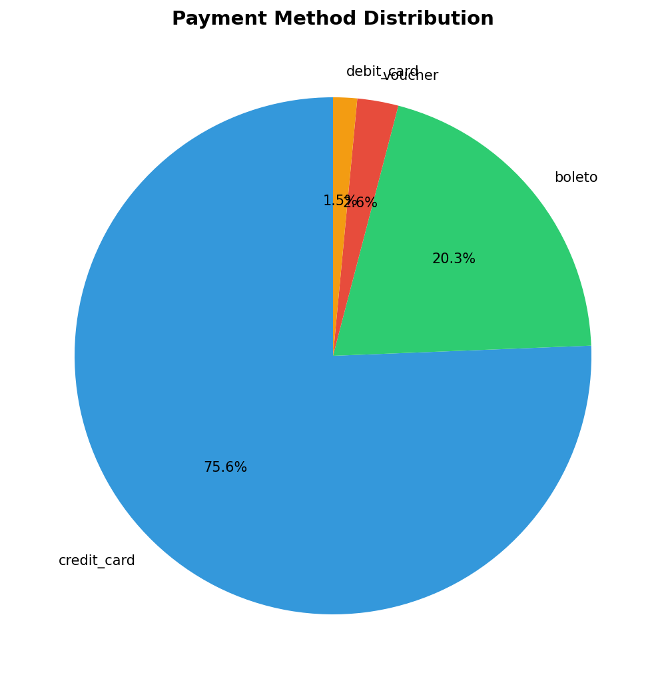
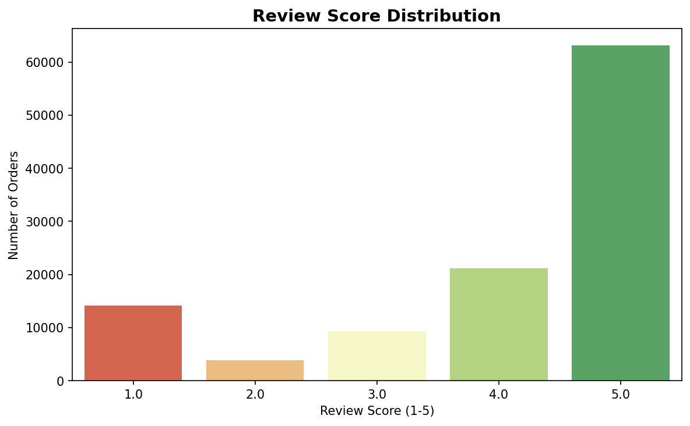

# Olist Brazilian E-Commerce Analysis
### End-to-End Python EDA | pandas • numpy • matplotlib • seaborn

---

## Project Overview
This project performs a full exploratory data analysis on the 
Olist Brazilian E-Commerce dataset from Kaggle — a real-world 
dataset containing 100,000+ orders placed on Brazil's largest 
e-commerce platform between 2016 and 2018.

The analysis merges 6 separate CSV files into a single master 
DataFrame of 112,650 rows and 25 columns, then extracts 
actionable business insights around delivery performance, 
customer satisfaction, revenue concentration, and geographic 
distribution.

---

## Dual Insight Finding

### Insight 1 — Delivery Kills Satisfaction
> Late deliveries correlate with a 46% drop in customer 
> satisfaction scores — from 4.21/5 (on time) to 2.26/5 (late).

While 93.41% of orders are delivered on time, the 6.59% that 
arrive late generate disproportionately negative reviews. 
This points to a clear business priority: logistics reliability 
is Olist's single biggest lever for improving customer experience.

### Insight 2 — Revenue is Top-Heavy
> Health & Beauty, Watches & Gifts, and Bed Bath & Table 
> collectively dominate platform revenue — all discretionary 
> lifestyle categories, not essentials.

This suggests Olist's core customer is a lifestyle shopper, 
not a necessity buyer — with implications for marketing 
targeting, seller acquisition, and seasonal campaign planning.

---

## Tech Stack
- **Python** — pandas, numpy, matplotlib, seaborn
- **Environment** — Google Colab
- **Dataset** — [Olist Brazilian E-Commerce (Kaggle)](https://www.kaggle.com/datasets/olistbr/brazilian-ecommerce)

---

## Dataset Structure
| File | Rows | Description |
|---|---|---|
| olist_orders_dataset | 99,441 | Order status and timestamps |
| olist_order_items_dataset | 112,650 | Items, prices, freight per order |
| olist_customers_dataset | 99,441 | Customer location data |
| olist_order_reviews_dataset | 99,224 | Review scores and comments |
| olist_order_payments_dataset | 103,886 | Payment type and installments |
| olist_products_dataset | 32,951 | Product categories |

---

## Analysis Summary

### 1. Delivery Performance
- 110,197 delivered orders analysed
- 93.41% delivered on time or early
- 6.59% late (~7,267 orders)

### 2. Review Score vs Delivery Status
- On time avg score: **4.21 / 5**
- Late avg score: **2.26 / 5**
- Drop: **46.3%**

### 3. Top Categories by Revenue
- #1 Health & Beauty — R$1,258,681
- #2 Watches & Gifts — R$1,205,005
- #3 Bed Bath & Table — R$1,036,988

### 4. Geographic Distribution
- São Paulo (SP) dominates order volume
- Strong concentration in Southeast Brazil

### 5. Delivery Delay by State
- Northern and remote states show worst delays
- Logistics infrastructure gap visible in data

### 6. Payment Methods
- Credit card is dominant payment method
- Installment payments widely used (Brazilian parcelamento culture)

### 7. Review Score Distribution
- Majority of reviews are 5-star
- 1-star reviews are second most common — classic J-curve pattern

---

## Charts

---

## Key Business Recommendations
1. **Prioritise logistics in northern states** — delay rates are 
highest in states furthest from São Paulo distribution centres
2. **Protect Health & Beauty and Watches categories** — they 
drive the most revenue and likely attract repeat lifestyle shoppers
3. **Use on-time delivery as a KPI** — the 46% satisfaction drop 
for late orders makes this the single most impactful metric to track

---

## Author
**Aryan Shaikh** — BMS Finance, Mumbai  
[LinkedIn](https://www.linkedin.com/in/aryanshaikh-analyst) • 
[Portfolio](https://aryan-shaikh-glitch.github.io/aryan-portfolio)
